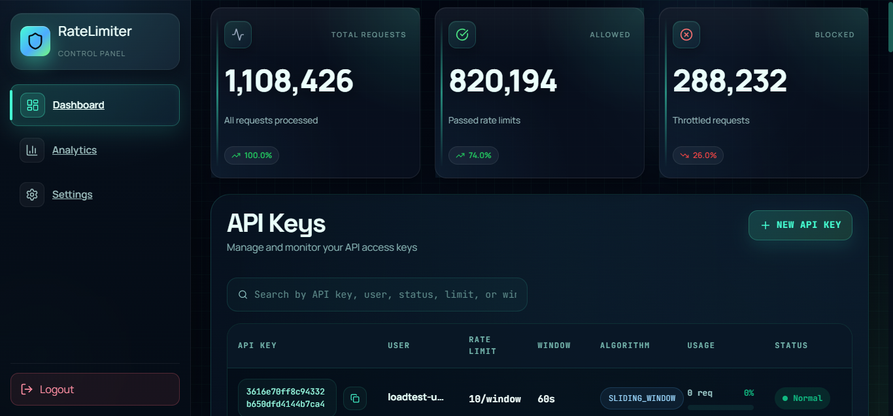
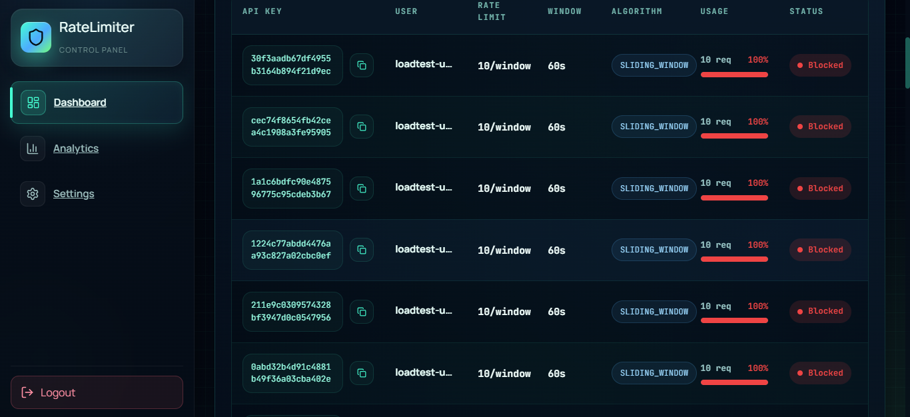
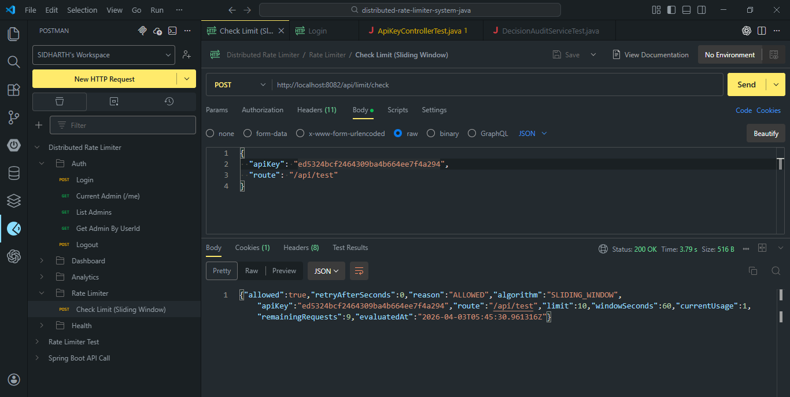

# Distributed Rate Limiter System

This project is a full-stack system that helps protect an application when too many requests arrive at once.

In simple words, it works like a smart traffic controller for APIs. Instead of letting unlimited requests hit the server and slow everything down, it checks how many requests are coming in, decides what should be allowed, and blocks extra traffic when limits are crossed. This helps keep the system stable, fair, and responsive.

It also gives administrators a dashboard where they can log in, create API keys, watch traffic in real time, and understand which requests are being allowed or blocked.

## Live Demo

There is no public live demo link added in this repository yet.

You can run the full project locally with Docker and use it as a complete working demo:

- Frontend: `http://localhost:5173` when running Vite locally
- Backend API: `http://localhost:8081`
- Grafana monitoring: `http://localhost:3002`
- Prometheus: `http://localhost:9091`

## Tech Stack

### Backend
- Java 17
- Spring Boot
- Spring Security
- Spring Data JPA
- PostgreSQL
- Redis
- JWT Authentication
- Micrometer + Prometheus

### Frontend
- React
- Vite
- React Router
- Bootstrap

### DevOps and Monitoring
- Docker
- Docker Compose
- Grafana
- Prometheus

## Features

- Admin login system using JWT-based authentication
- Create and manage API keys for different users or clients
- Distributed rate limiting with Redis
- Sliding window rate limiting algorithm
- Real-time dashboard for total, allowed, and blocked requests
- API key usage table with search and pagination
- Analytics view for traffic patterns
- Redis health check endpoint
- Monitoring support through Prometheus and Grafana
- Load testing assets using Postman, JMeter, and k6

## Screenshots

### System Architecture


### Dashboard UI



### Analytics View



### Testing Snapshot



## Installation Steps

### Option 1: Run everything with Docker

This is the easiest way to see the full project working.

1. Make sure Docker and Docker Compose are installed.
2. Open the project root folder.
3. Run:

```powershell
docker compose up --build -d
```

4. Open the services:

- Backend: `http://localhost:8081`
- Health check: `http://localhost:8081/actuator/health`
- Grafana: `http://localhost:3002`
- Prometheus: `http://localhost:9091`

5. To stop everything:

```powershell
docker compose down
```

### Option 2: Run frontend and backend manually

#### Backend

1. Make sure Java 17, Maven, PostgreSQL, and Redis are available.
2. Go to the backend folder:

```powershell
cd distributed-rate-limiter-backend
```

3. Start the Spring Boot app:

```powershell
.\mvnw.cmd spring-boot:run
```

#### Frontend

1. Open a new terminal.
2. Go to the frontend folder:

```powershell
cd distributed-rate-limiter-ui
```

3. Install packages:

```powershell
npm install
```

4. Start the frontend:

```powershell
npm run dev
```

## Default Local Credentials

These are the default local credentials used by the Docker setup in this repository:

- Admin login: `admin / admin`
- Grafana login: `admin / admin`
- PostgreSQL: `postgres / postgres`

## Environment Variables

You do not need to change everything to get started, but these are the main values the project uses.

### Backend

- `PORT` - backend server port, default `8082` in local properties and `8080` inside Docker
- `DB_URL` - PostgreSQL JDBC URL
- `DB_USERNAME` - PostgreSQL username
- `DB_PASSWORD` - PostgreSQL password
- `REDIS_HOST` - Redis host
- `REDIS_PORT` - Redis port
- `FRONTEND_BASE_URL` - frontend base URL
- `CORS_ALLOWED_ORIGINS` - allowed frontend origins
- `AUTH_ADMIN_USERNAME` - default admin username
- `AUTH_ADMIN_PASSWORD` - default admin password
- `AUTH_ADMIN_FULL_NAME` - default admin full name
- `AUTH_ADMIN_EMAIL` - default admin email
- `JWT_SECRET` - secret key for JWT tokens
- `JWT_EXPIRATION_MS` - token expiry time
- `UI_GRAFANA_DASHBOARD_URL` - Grafana dashboard link shown in the UI

### Frontend

- `VITE_API_BASE_URL` - backend base URL for frontend API calls

## API Endpoints

These are the main endpoints in a simple, brief format.

### Authentication

- `POST /api/auth/login` - log in as admin
- `GET /api/auth/me` - get current logged-in admin
- `PUT /api/auth/me` - update admin profile
- `GET /api/auth/admins` - list admins
- `GET /api/auth/admin/{userId}` - get one admin by user ID
- `POST /api/auth/logout` - logout response endpoint

### API Key and Rate Limiting

- `GET /api` - list API keys
- `POST /api/keys` - create a new API key
- `POST /api/limit/check` - check whether a request should be allowed or blocked
- `GET /api/stats` - get overall request stats

### Dashboard and Analytics

- `GET /api/view/dashboard` - fetch dashboard cards and API key table data
- `GET /api/analytics/view` - fetch analytics chart data
- `GET /api/analytics/keys` - get API key level usage stats
- `GET /api/analytics/recent-decisions` - recent rate-limit decisions
- `GET /api/stream/dashboard` - live dashboard updates using server-sent events

### Health and Config

- `GET /api/health/redis` - check Redis connection health
- `GET /api/config` - fetch frontend UI configuration from backend
- `GET /actuator/health` - Spring health endpoint
- `GET /actuator/prometheus` - Prometheus metrics endpoint

## Folder Structure

```text
distributed-rate-limiter-system-java/
|-- distributed-rate-limiter-backend/
|-- distributed-rate-limiter-ui/
|-- monitoring/
|-- testing/
|-- documents/
|-- docker-compose.yml
|-- DEPLOYMENT.md
```

### What each folder is for

- `distributed-rate-limiter-backend` - Spring Boot backend, security, APIs, Redis logic, and database layer
- `distributed-rate-limiter-ui` - React dashboard for login, traffic view, analytics, and settings
- `monitoring` - Prometheus and Grafana setup
- `testing` - load testing and API testing files
- `documents` - project screenshots, reports, architecture, and presentation files

## Why This Project Matters

Many applications fail not because the feature is wrong, but because too much traffic arrives at once.

This project tries to solve that problem in a practical and visible way. It does not just block requests in the background. It also helps a person understand what is happening through dashboards, analytics, and monitoring tools. That makes it useful both as a technical project and as a learning project.

## Future Improvements

- Add support for more rate-limiting algorithms
- Add role-based access control for multiple admin levels
- Add public cloud deployment links
- Improve API key management with edit and delete actions
- Add alerts through email or messaging tools
- Add more detailed analytics and historical trends
- Add automated CI/CD pipeline support

## Project Summary

If someone asks what this project does, the easiest answer is this:

It protects APIs from too much traffic, helps admins manage API keys, and shows everything clearly through a dashboard and monitoring tools.
